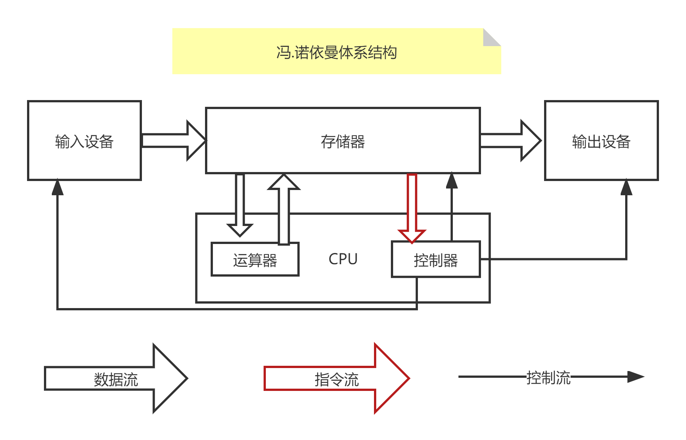

# 计算机与操作系统

## 什么是计算机

1. computer，全称电子计算机，俗称电脑
2. 能够按照程序运行，自动、高效处理海量数据的现代化智能电子设备
3. 由硬件和软件组成
4. 常见的形式有台式计算机、笔记本计算机、大型计算机、微型计算机等
5. 广泛应用在科学计算、数据处理、自动控制、计算机辅助设计、人工智能、网络等领域

## 计算机硬件

1. 一些物理装置按系统结构的要求构成一个有机整体为计算机软件运行提供物质基础
2. 计算机硬件组成
   - CPU
   - 主板
   - 内存
   - 电源、主机箱
   - 硬盘
   - 显卡
   - 键盘、鼠标
   - 显示器等

3. 冯.诺依曼体系结构
   - 输入设备
   - 存储器
   - 运算器
   - 控制器
   - 输出设备

## 计算机软件

1. 计算机然间可以使计算机按照事先预定好的顺序完成特定的功能
2. 计算机软件按照其功能划分为系统软件和应用软件
3. 系统软件
   - DOS（Disk Operating System）
   - Windows
   - Linux
   - Unix
   - Mac
   - Android
   - IOS

4. 应用软件
   - 文档软件，如wps
   - 通讯软件，如QQ
   - 游戏
   - 开发软件
   - 交互软件等

## 操作系统

## Windows

### Windows常用快捷键

1. 复制：Ctrl+c
2. 粘贴：Ctrl+v
3. 全选：Ctrl+A
4. 剪切：Ctrl+X
5. 撤销：Ctrl+Z
6. 保存：Ctrl+S
7. 关闭窗口：Alt+F4
8. 删除：Shift+delete
9. 运行：win+r
10. 打开文件资源管理器：win+e
11. 打开任务管理器：Ctrl+Shift+esc
12. 切换任务：win+tab

## Dos命令

1. 打开cmd
   - win+r输入cmd回车
   - 在任意文件夹下，按shift键右键点击，在此处打开命令行窗口
   - 在资源管理器的地址栏路径前面加上cmd空格

2. 切换盘符。如输入D:，回车
3. 查看当前目录下文件和目录。dir
4. 切换目录
   - 跨盘符切换：`cd \d 路径`
   - 返回上一级：`cd ..`
   - 不跨盘符：`cd 路径`

5. 清理屏幕：`cls（clear screen）`

6. 退出终端：`exit`
7. 查看ip：`ipconfig`
8. 查看系统内核信息：`systeminfo`
9. 创建文件夹：`md 目录名`
10. 创建文件：`cd>文件名`
11. 删除文件：`del 文件名`
12. 删除目录：`rd 目录名`
