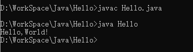

# Hello World详解

## 第一个Java程序hello world

``` Java
public class Hello{
    public static void main(String[] args){
        System.out.print("Hello,World!");
    }
}
```

## 代码详解

1. Java大小写敏感Hello与hello不一样

2. 最外层的函数名，这里是Hello，必须与文件名相同

3. 以分号;结束语句

   ``` java
                //类
   public class Hello{ 
                         //方法  //参数
       public static void main(String[] args){  
           //语句
           System.out.print("Hello,World!");
       }
   }
   ```

   

## 编译运行

1. 编译，编译成功后，目录下会出现一个Hello.class文件

   ``` java
   javac 文件名.java
   ```

2. 运行

   ``` java
   java 文件名
   ```

   