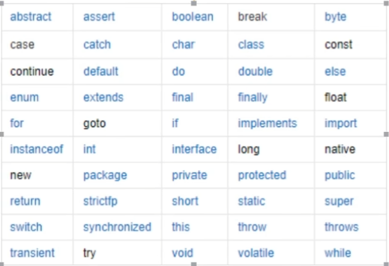

# 注释、标识符、关键字

## 注释

1. 单行注释：//

2. 多行注释：/* */

3. 文档注释

   ``` 
   /*
    *
    *
    */
   ```

   

## 关键字



## 标识符

1. Java所有的组成部分都需要名字。类名、变量名以及方法名都被称为标识符
2. 所有的标识符都应该以字母（A-Z或a-z）、美元符（$）或下划线（_）开始
3. 首字符之后可以说字母（A-Z或a-z）、美元符（$）、下划线（_）或数字的任何字符组合
4. 不能使用关键字作为变量名或方法名
5. 标识符是大小写敏感的
6. 可以使用中文命名，但一般不建议

